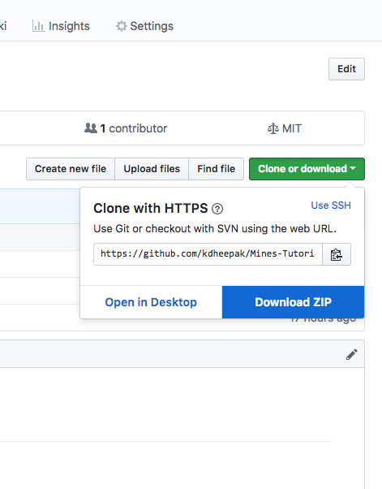

# Download Tutorial Material

[Click here for the link to the repository](https://github.com/kdheepak/Mines-Tutorial)

**Option 1: git clone the tutorial**

Type the following in a Terminal (Mac) or a Git Bash Command Prompt (Windows).

```bash
git clone https://github.com/kdheepak/Mines-Tutorial
```

**Option 2: download the tutorial as a ZIP file**

[Click here](https://github.com/kdheepak/Mines-Tutorial/archive/master.zip).

OR

[](https://github.com/kdheepak/Mines-Tutorial/archive/master.zip).
