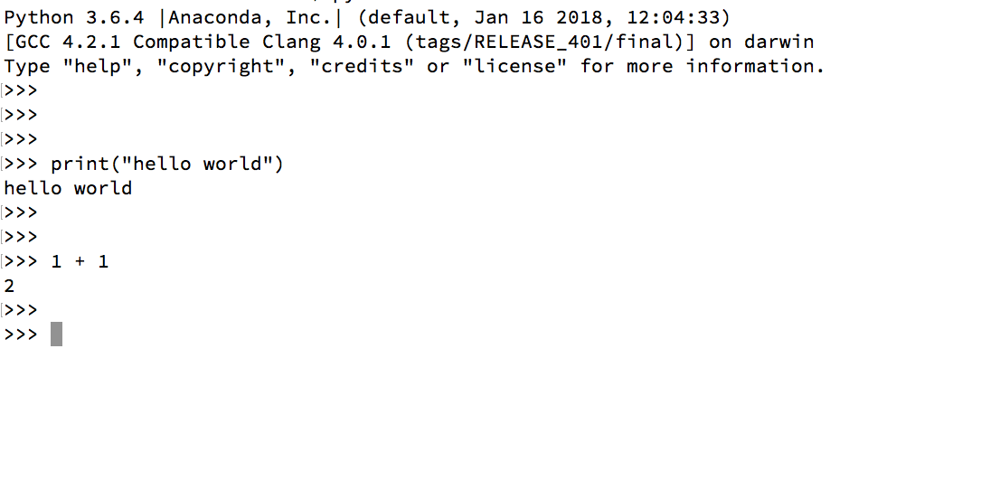

# Python

Python refers to the Python programming language.
Python also refers to the interpreter software [CPython](https://github.com/python/cpython).
CPython is the reference implementation of Python language written in C.
CPython is the most widely-used implementation of the language.
Other implementations of Python include Jython, IronPython, PyPy etc.

### How do you run Python?

Open a Terminal or the Command Prompt.

Type `python` and hit enter.

```bash
$ python
Python 3.6.4 |Anaconda, Inc.| (default, Jan 16 2018, 12:04:33)
[GCC 4.2.1 Compatible Clang 4.0.1 (tags/RELEASE_401/final)] on darwin
Type "help", "copyright", "credits" or "license" for more information.
>>>
>>>
>>>
>>> print("hello world")
hello world
>>>
>>>
>>> 1 + 1
2
>>>
>>>
```



Fun fact:

The name Python comes from the British comedy group Monty Python, and not from the snake.
Python programmers are usually called Pythonistas.
There are many Monty Python and snake references peppered around Python tutorials and documentation. Can you find them?

