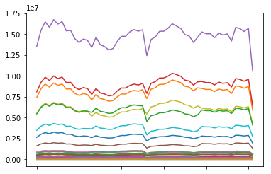

```python
import pandas as pd
```


```python
df = pd.read_excel("~/Desktop/weekprod2017tot.xls")
```


```python
df = df.T
```


```python
df.index = df.index.str.split("\n").map(lambda x: x[0])
```


```python
df = df.iloc[0:-1]
```


```python
df.loc["State"]
```


    0                       Alabama
    1                        Alaska
    2                       Arizona
    3                      Arkansas
    4                      Colorado
    5                      Illinois
    6                       Indiana
    7                Kentucky Total
    8                  Eastern (KY)
    9                  Western (KY)
    10                    Louisiana
    11                     Maryland
    12                  Mississippi
    13                     Missouri
    14                      Montana
    15                   New Mexico
    16                 North Dakota
    17                         Ohio
    18                     Oklahoma
    19           Pennsylvania Total
    20              Anthracite (PA)
    21              Bituminous (PA)
    22                    Tennessee
    23                        Texas
    24                         Utah
    25                     Virginia
    26          West Virginia Total
    27                Northern (WV)
    28                Southern (WV)
    29                      Wyoming
    30            Appalachian Total
    31               Interior Total
    32                Western Total
    33    East of Mississippi River
    34    West of Mississippi River
    35       Bituminous and Lignite
    36                   Anthracite
    37                   U.S. Total
    Name: State, dtype: object


```python
%matplotlib inline
```


```python
df.columns = df.iloc[0]
```


```python
df = df.drop("State", axis=0)
```


```python
df[[x for x in df.columns if x not in ["Bituminous and Lignite", "Anthracite"]]].plot(legend=False)
```


    <matplotlib.axes._subplots.AxesSubplot at 0x10e75a6d8>




